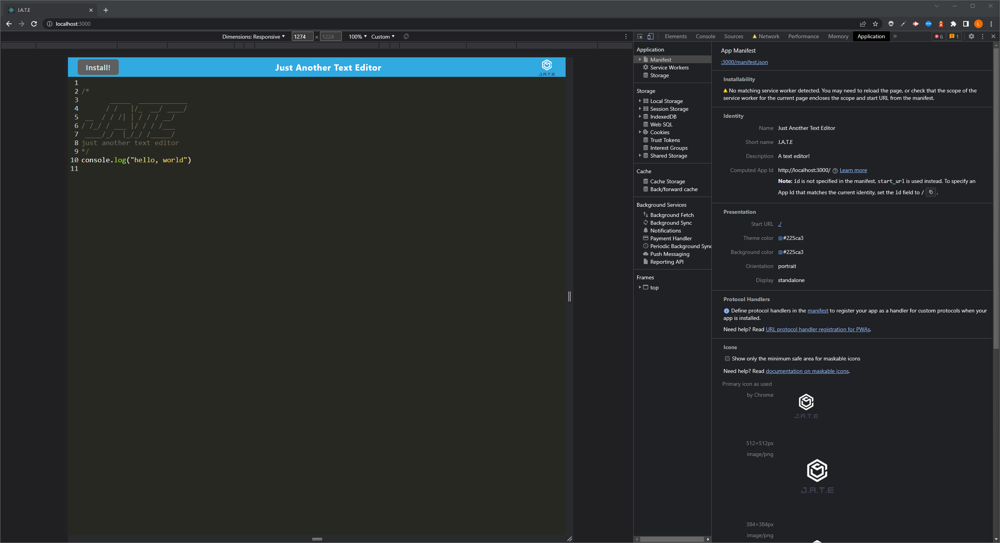
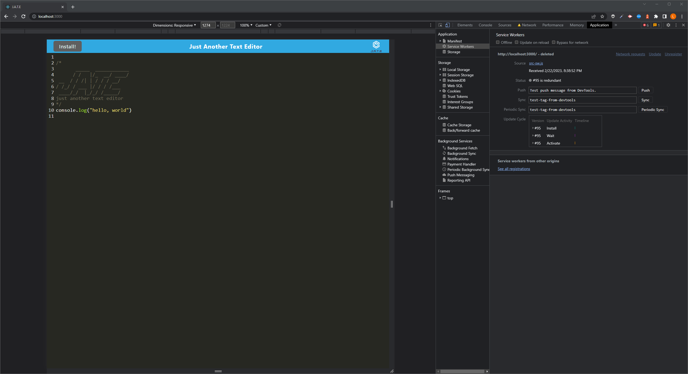
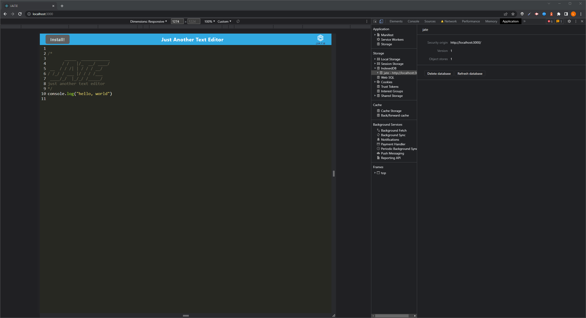
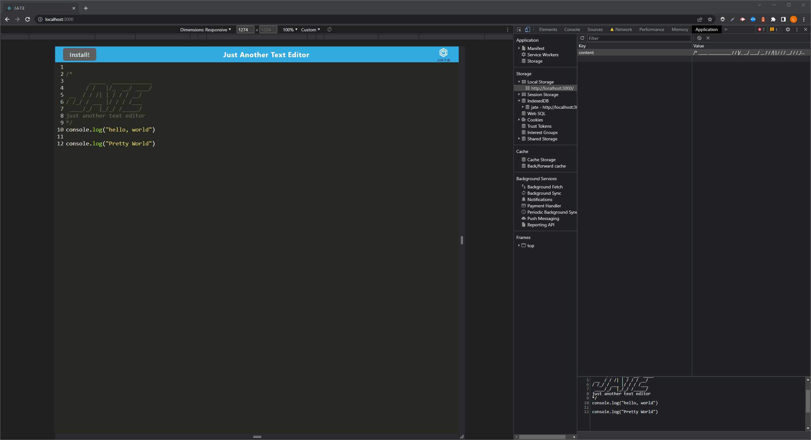

# text-editor

## Description

This is a text editor application that can be easily installed onto a web browser without requiring an internet connection. It uses an IndexedDB database, which is stored locally in the browser, and allows for offline editing. To begin using the application, the user must enter three command lines: "npm install", "npm run build", and "npm start". Once the application has been launched, it can be accessed by navigating to http://localhost:3000. The user can then click on the install button, which will trigger a pop-up message prompting them to install the application.

## Table of Contents

- [Description](#description)
- [Installation](#installation)
- [Usage](#usage)
- [Questions](#question)

## Installation

        npm i
        npm run build

then

        npm run start

## Usage

This is the link to my Webpage : https://pure-reef-32697.herokuapp.com/

This shows the layout of my application.

## Question

If you have any questions about the repo, open and issue or contact me directly at linhklatt@yahoo.com. You can find more of my works at [linhklatt](email)
